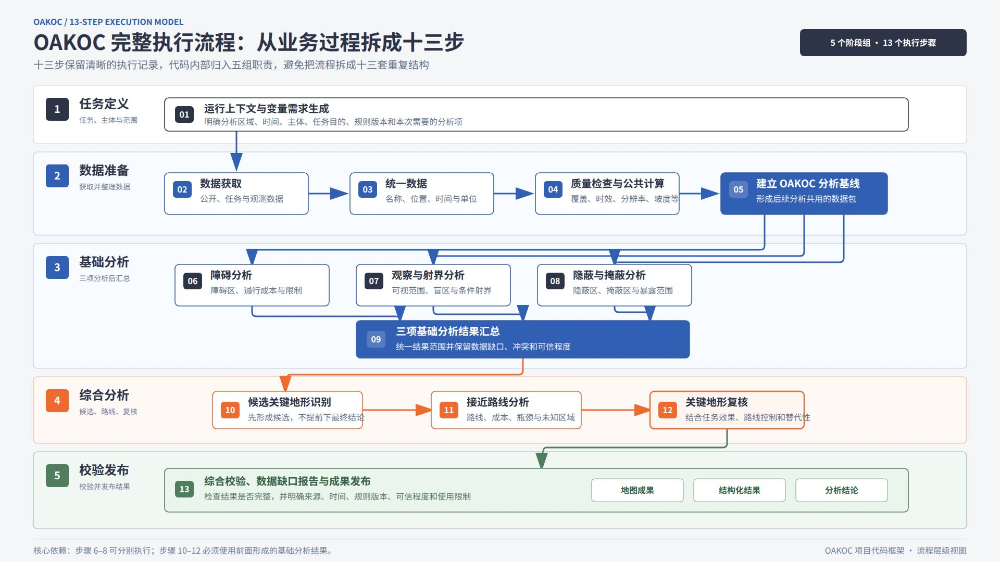

# OAKOC Process

本项目是 OAKOC（障碍、接近路线、关键地形、观察与射界、隐蔽与掩蔽）的 Python 代码框架。
它把一次 OAKOC 任务从输入、数据准备、基础分析、综合分析一直组织到结果发布，目的是先把
完整的业务流程、变量关系和数据来源固定下来，再逐步接入真实 GIS 数据和分析算法。

当前版本的准确定位是：**可运行的流程骨架、变量目录和数据接口原型**。它可以验证请求格式、
步骤顺序、分析依赖、数据缺口记录和结果结构，但还不能根据真实地图计算障碍区、可视域、
接近路线或最终关键地形。因此示例运行结果中的 `degraded` 和 `placeholder: true` 是有意保留的限制，
不能把它们理解为已经完成的战术地形结论。

## 1. 项目目标与边界

### 1.1 代码要解决的问题

一次完整 OAKOC 运行至少要回答下面几类问题：

1. 本次任务分析哪里、哪个时间段、针对哪个主体，以及要完成哪些分析；
2. 每个分析需要哪些变量，这些变量来自任务配置、公开数据、派生计算还是现场观测；
3. 数据是否覆盖 AOI，坐标系、时间、单位和分辨率是否可以统一；
4. 障碍、观察与射界、隐蔽与掩蔽之间如何形成基础证据；
5. 候选关键地形如何依赖基础分析，接近路线如何依赖候选和机动成本；
6. 关键地形为什么在路线分析后仍需要复核；
7. 哪些结果已经形成，哪些数据缺失，哪些结论只能作为低可信度或未知状态发布。

项目代码先把这些问题表达成稳定的数据模型和步骤接口，避免以后直接在一个大函数中混合读取数据、
计算地图和生成结论。真实数据服务和空间算法可以逐个替换相应的占位实现，而不改变整个流程的调用关系。

### 1.2 当前已经实现的内容

- 使用 Pydantic 定义任务请求、数据资产、变量规格、来源规格、质量记录、步骤记录和发布结果；
- 在变量目录中登记 66 个变量，并记录变量类型、必要性、实现优先级、公开可获得性、来源、依赖和缺失策略；
- 在来源目录中登记 10 个公开数据源，并记录访问方式、覆盖范围、分辨率、许可、限制和备用来源；
- 从任务请求反向生成本次运行的变量需求清单；
- 记录任务配置和数据资产与变量之间的绑定关系；
- 按固定顺序执行十三个步骤，并传播分析失败或缺少依赖的状态；
- 将关键地形拆成“候选识别”和“路线分析后的复核”两个节点；
- 生成可读取的 JSON 结果，保留运行编号、输入上下文、步骤状态、分析结果、数据缺口和发布清单；
- 提供完整 JSON 实例和自动测试。

### 1.3 当前明确没有实现的内容

- 不调用公开数据服务，不下载 Copernicus、Sentinel、OSM 等真实数据；
- 不执行真实的重投影、裁剪、重采样、时间对齐、覆盖率检查和质量计算；
- 不计算坡度、地表高度模型、通行成本、可视域、射界、隐蔽区或路线；
- 不生成 GeoTIFF、GeoJSON、GeoPackage 或真正的地图图片；
- 不连接 PostGIS、GeoParquet 数据湖或其他空间数据库；
- 六个分析节点目前都返回统一格式的示例结果，并带有 `placeholder: true`。

## 2. 整体结构

### 2.1 五个执行组与十三个步骤

流程保留十三个独立步骤，但代码文件不按十三步拆成十三个模块，而是将职责相近的步骤放入五个执行组：

| 执行组 | 步骤 | 主要职责 |
|---|---|---|
| 任务定义 | 1 | 根据任务上下文生成本次变量需求 |
| 数据准备 | 2-5 | 获取、统一、检查数据并建立分析基线 |
| 基础分析 | 6-9 | 完成三项基础分析并汇总其证据 |
| 综合分析 | 10-12 | 识别候选、分析路线、复核关键地形 |
| 校验发布 | 13 | 检查完整性并生成结构化成果索引 |

保留十三个步骤的原因是：每一步的输入输出、失败原因、重试边界和数据血缘都不同。代码内部合并相近职责，
是为了避免维护十三套重复的类；结果中仍然保留十三条 `StageRecord`，便于定位流程停在哪一步。

### 2.2 十三步流程图

下面的结构图展示了五个执行组、十三个步骤和主要依赖关系。图中的“候选关键地形”与“关键地形复核”
分开，表示关键地形不能在路线分析前直接当成最终结论。



图像文件保存在 `docs/oakoc-13-step-process.jpg`，README 使用仓库内的相对路径，因此在其他机器和
代码托管平台上也可以随项目一起显示。

### 2.3 六个计算节点对应五项 OAKOC 内容

OAKOC 有五项业务内容，但代码有六个分析节点：

| 分析节点 | 对应内容 | 为什么单独存在 |
|---|---|---|
| `obstacles` | 障碍 | 识别自然、人工和动态条件对机动的限制 |
| `observation_and_fire` | 观察与射界 | 同时保留几何通视和能力相关射界的接口 |
| `cover_and_concealment` | 隐蔽与掩蔽 | 相对于观察或作用威胁评价暴露和防护代理 |
| `key_terrain_candidates` | 关键地形初筛 | 先依据任务效果和基础证据形成候选 |
| `approach_routes` | 接近路线 | 使用候选、通行成本、暴露面和起终区域计算路线 |
| `key_terrain_review` | 关键地形复核 | 用路线瓶颈、替代性和控制关系确认或保留不确定性 |

## 3. 文件和代码职责

### 3.1 入口和核心模块

| 文件 | 解决什么问题 | 当前实际功能 |
|---|---|---|
| `OAKOCProcess.py` | 如何从命令行启动一次任务 | 读取 JSON、调用管线、将结果打印或保存为 JSON |
| `oakoc/models.py` | 不同步骤之间传递什么数据 | 定义枚举、输入模型、质量模型、变量模型、分析结果和发布模型 |
| `oakoc/catalog.py` | 变量和公开来源怎样登记 | 构建 66 个变量规格和 10 个来源规格，供需求生成和文档使用 |
| `oakoc/pipeline.py` | 十三步怎样按顺序运行 | 生成需求、登记绑定、准备上下文、调度分析、处理失败并发布结果 |
| `oakoc/analyzers.py` | 每项 OAKOC 分析如何被调用 | 定义统一的 `AnalyzerSpec` 接口和六个示例分析函数 |
| `oakoc/__init__.py` | 外部调用方从哪里导入公共接口 | 集中导出请求、结果、管线、目录和分析规格 |

### 3.2 实例、文档和测试

| 文件 | 作用 |
|---|---|
| `examples/full_process_request.json` | 默认完整输入，包含任务、AOI、模拟数据资产和分析配置 |
| `examples/full_process_result.json` | 用默认输入运行一次后保存的完整结果示例 |
| `docs/variable-design.md` | 按十三步解释变量目的、来源能力、缺失影响和第一版范围 |
| `docs/oakoc-13-step-process.jpg` | 展示五个执行组、十三个步骤及主要依赖的流程图 |
| `tests/test_pipeline.py` | 测试步骤顺序、依赖失败、条件变量需求、目录内容和正式模式限制 |
| `tests/test_full_process_example.py` | 测试从外部 JSON 读取请求并写出可再次读取的结果 |
| `pyproject.toml` | 声明 Python 版本、项目元数据和 Pydantic 依赖 |
| `uv.lock` | 固定 uv 环境中的依赖版本 |
| `.gitignore` | 排除 Python 缓存、虚拟环境和本地运行文件 |

## 4. 输入、变量和输出怎样流动

### 4.1 输入请求的四个部分

`AnalysisRequest` 是管线的唯一标准入口。不同来源的数据在进入管线前都应转换成这一格式。

| 输入字段 | 主要内容 | 后续用途 |
|---|---|---|
| `mission` | 任务名称、目的、期望状态和任务阶段 | 生成需求，解释候选关键地形和路线效果 |
| `actors` | 行动主体编号、名称和阵营 | 说明分析视角和结果适用对象 |
| `environment` | AOI 和已取得的数据资产 | 提供空间边界、文件地址、来源和变量声明 |
| `control` | 规则版本、时间窗、目标 CRS、分辨率、能力配置、约束和路线端点 | 控制本次分析如何运行 |

示例中的数据地址使用 `fixture://`，表示“模拟资产登记”，不是可以访问的真实文件。它用于验证数据血缘字段
和流程连接，不会被程序下载。

### 4.2 变量的职责分类

变量目录用 `data_role` 区分业务变量的职责，用 `value_type` 说明内容类型；质量字段单独存储，避免把“变量是什么”
和“这次数据质量如何”混在一起。

| `data_role` | 白话解释 | 示例 |
|---|---|---|
| `context` | 任务区域、时间、目的和分析主体 | `context.aoi` |
| `entity` | 道路、建筑、水系等地图对象 | `entity.transport_network` |
| `raster` | 高程、土地覆盖、影像和天气网格 | `raster.elevation` |
| `observation` | 现场、情报或人工记录的动态状态 | `observation.water_state` |
| `parameter` | 平台、传感器、火力和分辨率设置 | `parameter.sensor_profile` |
| `derived` | 程序从其他数据计算出的公共变量 | `derived.slope` |
| `result` | 某个分析步骤输出的结果 | `result.approach_routes` |

每个 `VariableSpec` 还包括：

- `requirement_level`：必需、条件必需或可选；
- `implementation_priority`：第一版优先级，目前为 P0 或 P1；
- `accessibility`：直接获取、可派生、只能使用代理或当前不可得；
- `acquisition_modes`：公开直接、公开派生、任务配置、现场观测或混合来源；
- `source_priority` 和 `source_fields`：主来源顺序以及对应波段、标签或字段；
- `depends_on` 和 `derivation`：计算依赖和派生思路；
- `quality_requirement`：覆盖率、目标分辨率、允许时效和检查项；
- `missing_policies`：缺失时阻断、掩膜、使用代理、保留未知或要求补充观测；
- `used_by`：后续哪些步骤会消费该变量。

### 4.3 目录定义、运行绑定和实际质量是三件事

项目刻意把下面三个概念分开：

1. `VariableSpec`：目录中定义“变量应该是什么”；
2. `VariableBinding`：本次运行登记“变量来自哪个任务字段或数据资产”；
3. `QualityAssessment`：实际读取后判断“这份数据覆盖多少、是否过期、分辨率是多少”。

当前版本已经实现前两层的模型和部分绑定登记，但还没有真正生成第三层的质量测量结果。资产被绑定不等于文件
已经成功下载或内容已经通过检查，这也是默认实例最终显示 `degraded` 的原因。

### 4.4 输出结果的主要字段

`PipelineResult` 是一次运行的总结果：

| 字段 | 内容 |
|---|---|
| `run_id` | 将需求、步骤和发布结果串起来的唯一编号 |
| `status` | 整体为 `succeeded`、`degraded` 或 `failed` |
| `context` | 原始请求、需求清单、变量绑定、统一 CRS 和数据提示 |
| `stages` | 十三个步骤的开始时间、结束时间、状态和说明 |
| `analyses` | 已调用分析节点的统一结果，包括范围、来源、警告和可信程度 |
| `validation_issues` | 发布前发现的缺失结果或正式模式限制 |
| `output` | 地图产品索引、结构化章节、数据缺口和综合说明 |

分析结果必须保留 AOI、分析视角、有效时间窗、规则版本和证据来源。当前结果还没有真正的栅格或矢量载荷，只有
统一的文字判断和引用，因此不能替代 GIS 分析产物。

## 5. 十三步在代码中分别做什么

下面的“当前实现”描述的是现有代码确实做了什么，不把目录中的未来设计当成已经完成的功能。

| 步骤 | 阶段 ID | 主要输入 | 设计输出 | 当前实现 |
|---|---|---|---|---|
| 1 | `context.requirements` | `mission`、`control`、变量目录 | `RequirementManifest` | 按请求分析项列出必要变量、缺失变量和受影响步骤 |
| 2 | `data.acquire` | 数据资产和任务配置 | `VariableBinding` | 登记资产与变量关系；不查询、不下载公开数据 |
| 3 | `data.normalize` | AOI、资产 CRS、时间和格式 | `PreparedContext` 的统一上下文 | 选择或记录目标 CRS；不执行重投影、裁剪和单位转换 |
| 4 | `data.quality_and_derive` | 标准化数据和质量要求 | 质量报告、坡度等公共派生变量 | 只记录步骤状态；不读取栅格，也不计算派生变量 |
| 5 | `baseline.build` | 统一数据和质量结果 | 分析基线和就绪状态 | 记录“框架基线已形成”；没有真实基线数据包 |
| 6 | `analysis.obstacles` | 基线、机动配置、动态状态 | 障碍区、机动成本、通行限制 | 调用 `analyze_obstacles()`，返回占位结果 |
| 7 | `analysis.observation_and_fire` | 表面高度、传感器和火力配置 | 可视域、观察缺口、射界和死角 | 调用 `analyze_observation_and_fire()`，返回占位结果 |
| 8 | `analysis.cover_and_concealment` | 基线、观察条件和威胁配置 | 隐蔽区、掩蔽区和暴露面 | 调用 `analyze_cover_and_concealment()`，返回占位结果 |
| 9 | `analysis.foundation_aggregate` | 步骤 6-8 的结果 | 基础证据汇总和冲突记录 | 只检查三项基础结果是否都返回，不做空间汇总或冲突计算 |
| 10 | `analysis.key_terrain_candidates` | 任务目的、效果判据和基础证据 | 关键地形候选及控制效果 | 调用候选分析占位函数 |
| 11 | `analysis.approach_routes` | 起终区域、机动成本、暴露面和候选 | 候选路线、成本剖面、瓶颈和时机 | 调用路线分析占位函数 |
| 12 | `analysis.key_terrain_review` | 候选、路线、瓶颈和任务效果 | 复核后的关键地形及路线相关性 | 调用复核占位函数 |
| 13 | `publish.validate_and_release` | 所需结果、缺口和运行模式 | 校验信息、成果索引和综合说明 | 生成 JSON 结果；地图条目仍是“待渲染器实现”文字 |

步骤 6-8 在形成基线后互不依赖；步骤 10-12 必须使用前面形成的基础结果。这些依赖关系由
`AnalyzerSpec.depends_on` 和 `OAKOCPipeline.run()` 共同执行。

## 6. 公开数据来源怎样对应变量

`oakoc/catalog.py` 中的 `SourceSpec` 只描述公开服务的能力和边界，不表示适配器已经写好。当前登记的来源如下：

| 来源 | 主要变量 | 访问方式 | 核实状态 | 主要限制 |
|---|---|---|---|---|
| Copernicus DEM GLO-30 | `raster.elevation` | OData、S3、HTTPS | `partial` | 高程不包含实时建筑、植被和地表状态 |
| ESA WorldCover 2021 | `raster.land_cover` | HTTPS | `partial` | 分类不代表冠层结构、土壤强度或近期损毁 |
| Sentinel-1 GRD | `raster.sar_imagery` | STAC、OData、S3 | `verified` | 雷达变化信号不能直接证明积水或障碍 |
| Sentinel-2 L2A | `raster.optical_imagery` | STAC、OData、S3 | `partial` | 云、阴影和重访时间可能使影像不可用 |
| OSM Overpass | `entity.transport_network`、`entity.buildings`、`entity.hydrography` | Overpass API | `verified` | 标签缺失不等于对象不存在，批量查询受限 |
| Geofabrik OSM | 同上 | PBF 下载、HTTPS | `pending` | 区域快照需要裁剪，标签完整性仍受 OSM 影响 |
| SoilGrids 2.0 | `raster.soil_properties` | REST、WCS、HTTPS | `partial` | 250 m 模型属性不能直接给出实时通行性 |
| HydroRIVERS | `entity.hydrography` | HTTPS | `partial` | 区域河网不能替代局地河宽、水深和流速 |
| JRC Global Surface Water | `raster.surface_water_history` | HTTPS | `pending` | 历史统计不能给出当前可渡性 |
| ERA5-Land | `raster.weather_fields` | CDS API、HTTPS | `verified` | 约 9 km 背景场不能表达战术尺度局地天气 |

来源的 `verification_status` 只表示入口和能力描述核实到什么程度。`adapter` 字段是未来适配器的代码名称，
不是已经存在的 Python 模块。真正接入时应按下面的顺序形成数据血缘：

```text
SourceSpec
  -> 按 AOI、时间窗和产品条件查询
  -> 选择可计算资产并记录版本和许可
  -> 下载或挂载 GeoTIFF/COG、PBF、GeoJSON、GeoParquet、GRIB/NetCDF
  -> 检查 CRS、覆盖、NoData、时间、校验和以及字段完整性
  -> 生成 VariableBinding 和 QualityAssessment
  -> 应用 BLOCK、MASK、PROXY、UNKNOWN 或补充观测策略
```

WMS/WMTS 适合地图显示，第一版分析输入应优先使用可计算格式。公开数据缺失时不能把对象当成不存在；对桥梁承载、
实时水文、临时障碍、建筑防护和局地能见度等高影响信息，应保留 `UNKNOWN`、结果限制或补充观测需求。

## 7. 当前运行结果应怎样理解

使用完整实例运行时，通常会得到：

- 十三个步骤都有记录；
- 六个分析节点都被调用；
- 第 1 步和第 2 步可以在输入登记层面显示完成；
- 第 3 步到第 13 步显示 `degraded`，因为真实数据处理和算法还没有接入；
- 六个分析结果的 `placeholder` 都是 `true`；
- `validation_issues` 可以为空，但这只表示流程没有发现“缺少应返回的节点”，不表示地图分析已经完成；
- 完整实例的 `fixture://` 资产不会被读取，结果中的地图产品只是待办索引。

状态含义如下：

| 状态 | 含义 |
|---|---|
| `succeeded` | 该步骤或运行已完成，且没有已知限制 |
| `degraded` | 已继续执行，但数据、质量或算法存在明确限制 |
| `failed` | 发生错误，无法形成该步骤所需结果 |
| `skipped` | 未请求该分析，或前置依赖没有成功生成 |

特别要注意：完整实例中“必要输入缺口为 0”只表示任务配置和示例资产声明了当前所需的外部输入。坡度、分析基线、
障碍区、路线等程序派生结果并没有因此自动生成。

## 8. 运行方法

项目需要 Python 3.11 或更高版本，并使用 `uv` 管理依赖。以下命令在项目根目录执行。

### 8.1 运行默认实例并在终端查看完整 JSON

```bash
uv run python OAKOCProcess.py
```

省略 `--input` 时默认读取 `examples/full_process_request.json`。省略 `--output` 时，完整结果直接打印到终端，
不会在磁盘生成新的结果文件。

### 8.2 运行实例并保存完整结果

```bash
uv run python OAKOCProcess.py \
  --input examples/full_process_request.json \
  --output examples/full_process_result.json
```

传入 `--output` 后，结果写入指定 JSON 文件，终端不重复打印完整内容。输出目录必须已经存在。

### 8.3 使用自己的请求文件

```bash
uv run python OAKOCProcess.py \
  --input request.json \
  --output result.json
```

自定义文件必须符合 `AnalysisRequest` 结构。至少需要任务、行动主体、AOI、时间窗、规则版本和控制字段；具体变量需求
会根据 `requested_analyses` 变化。

### 8.4 运行测试

```bash
uv run python -m unittest discover -s tests -v
```

测试覆盖的是数据模型、流程顺序、需求清单、失败传播和 JSON 读写，不验证真实 GIS 算法的空间正确性。

## 9. 后续实现顺序

为了让代码逐步靠近最初目标，建议按照下面的顺序扩展：

1. 为 DEM、WorldCover 和 OSM 编写最小可用适配器，先支持本地缓存和一个 AOI；
2. 实现 CRS 转换、AOI 裁剪、栅格对齐、NoData 掩膜和质量报告；
3. 实现坡度、基础机动证据面、表面高度模型和水障碍证据等公共派生变量；
4. 将六个占位分析器替换为带栅格或矢量载荷的专用结果模型；
5. 接入机动、传感器和火力规则配置，明确每个结果的单位、阈值和适用主体；
6. 实现基础证据汇总、候选关键地形、路线成本和复核逻辑；
7. 增加 GeoJSON、GeoTIFF、GeoPackage 或地图服务发布器；
8. 用小范围的已知数据和人工校核样例验证每个分析结果，而不是只验证函数是否被调用。

这套顺序保留了当前项目的主题边界：先完成输入、变量、来源、质量和流程闭环，再逐项增加真实空间计算，
不会把尚未证实的公开数据能力或默认值写成确定事实。
